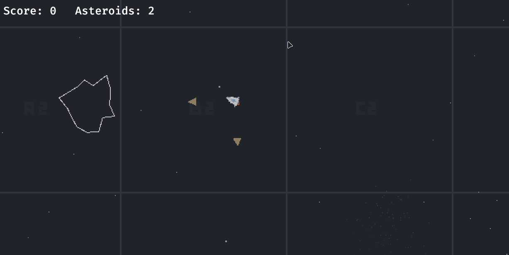

# Rusteroids

This is a crappy asteroids-like game written in Rust, using Bevy engine and Rapier2d. The purpose of this project was to
learn Rust in a playful way. Please excuse the awful code; this the first time I'm looking at Rust (and Bevy), so there
will be millions of things that could have been done in a better and more idiomatic way.

> [!IMPORTANT]
> I'm still working on this, so the info below will be incomplete.

## Demo



## Features

- Infinite wave system with increasing difficulty
- Single-button menu to exit the game
- Audio
- Collision system powered by `bevy_rapier2d`
- Particles powered by `bevy_enoki`

## How to develop

### Using Nix Flakes, JetBrains RustRover & Direnv

You can run this project in any way you like, but I have set things up to make it easy to develop using JetBrains
RustRover. For this, you'll need:

- `direnv`
- Any Direnv integration plugin e.g. https://plugins.jetbrains.com/plugin/15285-direnv-integration
- `nix`

This way, you'll just need to `direnv allow` in the project directory after which all prerequisites (incl. Rust, Cargo,
all Bevy dependencies, etc.) will be available to you. The JetBrains plugin will ensure that the environment is
available to your IDE and you can run the project from there (vs `cargo build` and `cargo run` in the terminal).

### Using Nix Flakes

Without `direnv`, you can use the Nix Flake by running `nix develop` in the project directory. If you want to use an IDE
such as JetBrains RustRover, you'll have to set up the environment manually. You'll most likely have to make
`LD_LIBRARY_PATH` available to your IDE.

## How to build WASM for the web

Prerequisites:
1. Run `rustup target add wasm32-unknown-unknown`
2. Set `RUSTFLAGS`
   1. Linux: `export RUSTFLAGS="--cfg=web_sys_unstable_apis"`
   2. Windows: `$env:RUSTFLAGS="--cfg=web_sys_unstable_apis"`
3. Make sure you have Node.js with `serve` installed

Then you can build the WASM file:
1. Run `cargo build --target wasm32-unknown-unknown --release`
2. Run `wasm-bindgen` to generate the JS bindings:
   1. **Linux**: `wasm-bindgen --out-dir ./www/public --target web ./target/wasm32-unknown-unknown/release/rusteroids.wasm`
   2. **Windows**: `wasm-bindgen.exe --out-dir ./www/public --target web ./target/wasm32-unknown-unknown/release/rusteroids.wasm`
3. Make sure you have the assets in the `www/public` directory:
   ```shell
   ./scripts/copy-assets.ps1   # Windows
   ```

You can optimise the WASM file (from [Unofficial Bevy Cheat Book](https://bevy-cheatbook.github.io/platforms/wasm/size-opt.html)):
```shell
# Optimize for size (z profile).
wasm-opt -Oz -o output.wasm input.wasm

# Optimize for size (s profile).
wasm-opt -Os -o output.wasm input.wasm

# Optimize for speed.
wasm-opt -O3 -o output.wasm input.wasm

# Optimize for both size and speed.
wasm-opt -O -ol 100 -s 100 -o output.wasm input.wasm
```

To run the game in your browser locally:
1. Run `cd www/public`
2. Run `npx serve ./www/public`
Finally, run `npx serve .`

