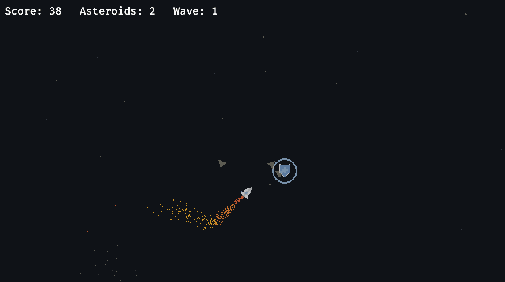

# Rusteroids

This is a crappy asteroids-like game written in Rust, using Bevy engine and Rapier2d. The purpose of this project was to
learn Rust in a playful way. Please excuse the awful code; this the first time I'm looking at Rust (and Bevy), so there
will be millions of things that could have been done in a better and more idiomatic way.

## Demo



## Features

- Infinite wave system with increasing difficulty
- Single-button menu to exit the game :-)
- Basic audio
- Collision system powered by `bevy_rapier2d`
- Particles powered by `bevy_enoki`

## Attribution

The in-game (non-UI) font is Bulky Pixels by John Bloor's [Smoking Drum ](http://www.smokingdrum.com) (domain no longer
active but required by license).

Audio files from [Pixabay](https://pixabay.com) under a CC0 license or created by myself.

## How to develop

### Using Nix Flakes, JetBrains RustRover & Direnv

You can run this project in any way you like, but I have set things up to make it easy to develop using JetBrains
RustRover. For this, you'll need:

- `direnv`
- Any Direnv integration plugin e.g. https://plugins.jetbrains.com/plugin/15285-direnv-integration
- `nix`

This way, you'll just need to `direnv allow` in the project directory after which all prerequisites (incl. Rust, Cargo,
all Bevy dependencies, etc.) will be available to you. The JetBrains plugin will ensure that the environment is
available to your IDE and you can run the project from there (vs `cargo build` and `cargo run` in the terminal).

### Using Nix Flakes

Without `direnv`, you can use the Nix Flake by running `nix develop` in the project directory. If you want to use an IDE
such as JetBrains RustRover, you'll have to set up the environment manually. You'll most likely have to make
`LD_LIBRARY_PATH` available to your IDE.

### Reminders

- Create a run configuration with environment variable `RUST_LOG=rusteroids=debug` for debug logs e.g. damage,
  collisions, explosions
- Create a run configuration with `--features dev` to enable `RapierDebugRenderPlugin` and `WorldInspectorPlugin`

## How to build WASM for the web

#### Prerequisites

1. Run:
   ```shell
   rustup target add wasm32-unknown-unknown
   ```
2. Set `RUSTFLAGS`
    1. **Linux**:
       ```bash
       export RUSTFLAGS="--cfg=web_sys_unstable_apis"
       ```
    2. **Windows**:
       ```powershell
       $env:RUSTFLAGS="--cfg=web_sys_unstable_apis"
       ```
3. Make sure you have Node.js with `serve` installed

#### Building

Then you can build the WASM file:

1. Build the WASM file:
   ```shell
   cargo build --target wasm32-unknown-unknown --release
   ```
2. Clean the `www/public` directory and copy the game's assets over:
   ```powershell
   ./scripts/clean-rusteroids-files.ps1 # Windows only, bash script may be coming later
   ./scripts/copy-assets.ps1   # Windows only, bash script may be coming later
   ```
3. Run `wasm-bindgen` to generate the JS bindings and move all relevant files to the `www/public` directory:
    1. **Linux**:
       ```shell
       wasm-bindgen --out-dir ./www/public --target web ./target/wasm32-unknown-unknown/release/rusteroids.wasm
       ```
    2. **Windows**:
       ```powershell
       wasm-bindgen.exe --out-dir ./www/public --target web ./target/wasm32-unknown-unknown/release/rusteroids.wasm
       ```

#### Optimising

You can optimise the WASM file (from the
[Unofficial Bevy Cheat Book](https://bevy-cheatbook.github.io/platforms/wasm/size-opt.html)):

   ```shell
   # Optimize for size (z profile).
   wasm-opt -Oz -o output.wasm input.wasm
   
   # Optimize for size (s profile).
   wasm-opt -Os -o output.wasm input.wasm
   
   # Optimize for speed.
   wasm-opt -O3 -o output.wasm input.wasm
   
   # Optimize for both size and speed.
   wasm-opt -O -ol 100 -s 100 -o output.wasm input.wasm
   ```

#### Running

Finally, to run the game in your browser locally, run the below and paste the URL copied to your clipboard into your
browser:

```shell
npx serve ./www/public
```